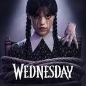

# NetFlix_Clone
## Date:9/7/2025
## Objective:
To create a modern, responsive navigation bar using CSS Flexbox, mimicking real-world websites like Netflix. This helps reinforce alignment, spacing, and layout structuring using Flexbox properties.

## Tasks:

#### 1. Structure the HTML Layout:
Use a ```<nav>``` tag as the main container.

Add a brand logo/title on the left using a ```<div> or <h1>```.

Add navigation links like Home, Menu, About, Contact, and Login using a ```<ul> with <li> and <a>```.

#### 2. Apply Flexbox for Layout:
Use display: flex on the ```<nav>``` container.

Use justify-content: space-between to align the logo and menu.

Use align-items: center to vertically center both sections.

Style list items with horizontal spacing using gap or margin.

#### 3. Style Like a Real-World Navbar:
Add background color (e.g., dark or gradient like Netflix/Zomato).

Style text with bold fonts, hover effects, and link styling.

Remove default ul and li styles (list-style: none, text-decoration: none).

#### 4. Bonus Enhancements:
Add a hover underline or button effect on links.

Make it responsive using flex-wrap or media queries.

Fix the nav bar to top with position: sticky.
## HTML Code:
```

<!DOCTYPE html>
<html lang="en">
<head>
  <meta charset="UTF-8" />
  <meta name="viewport" content="width=device-width, initial-scale=1.0"/>
  <title>Netflix Clone Hero Section</title>
  <link rel="stylesheet" href="style.css">
</head>
<body>
  <div class="container">
<nav>
    <div class="logo">NetflixClone</div>
    <ul>
      <li><a href="#">Home</a></li>
      <li><a href="#">Menu</a></li>
      <li><a href="#">About</a></li>
      <li><a href="#">Contact</a></li>
      <li><a href="#">Login</a></li>
    </ul>
  </nav>
  <section class="hero">
    <div class="hero-left">
      <h1>LEO</h1>
      <p><strong>Director:</strong> Lokesh Kanagaraj</p>
      <p><strong>Year:</strong> 2023</p>
      <button class="btn">Stream Now</button>
    </div>
    <div class="hero-right">
      
      
    </div>
  </section>

  <div class="section-title">Popular Shows This Week</div>
  <section class="popular-shows">
    <div class="show-card">
      
      <p>Goat</p>
    </div>
    <div class="show-card">
      
      <p>Wednesday</p>
    </div>
    <div class="show-card">
      
      <p>Squid Game</p>
    </div>
    <div class="show-card">
      
      <p>Suzhal</p>
    </div>
  </section>
  </div>

</body>
</html>


```
## CSS Code:
```

* {
      margin: 0;
      padding: 0;
      box-sizing: border-box;
    }

    body {
      font-family: 'Segoe UI', sans-serif;
      background-color: #121212;
      color: white;
    }
    .container{
      background: url(nett.jpg) no-repeat center center/cover;
      
      height: 100vh;
    }

    nav {
      background: linear-gradient(to right, #111, #222);
      display: flex;
      justify-content: space-between;
      align-items: center;
      padding: 25px;
      padding-right: 35px;
    }
    .logo{
        font-size: 1.8rem;
        font-weight: bold;
        color: #e40914;
    }
    ul{
        display: flex;
        gap: 2rem;
        list-style: none;
    }
    ul li a{
        color: white;
        transition: all 0.3s ease-in-out;
        font-weight: 500;
        text-decoration: none;
        position: relative;
    }
    ul li a::after {
        content: '';
        position: absolute;
        left: 0;
        bottom: -4px;
        width: 0%;
        height: 2px;
        background-color: #e50914;
        transition: width 0.3s ease-in-out;
    }
    ul li a:hover::after{
        width: 100%;
    }
    ul li a:hover{
        color: #e50914;
    }
   

    .hero {
      display: flex;
      justify-content: space-between;
      align-items: center;
      padding: 60px 50px;
      background-color: #a98787;
      background: url(nett.jpg) no-repeat center center/cover;
      height: 70vh;
    }

    .hero-left {
      flex: 1;
    }

    .hero-left h1 {
      font-size: 4rem;
      margin-bottom: 20px;
    }

    .hero-left p {
      margin: 10px 0;
      font-size: 1.1rem;
      color: #ccc;
    }
    .hero-left .btn{
        margin-top: 20px;
    }
    .btn{
        border: none;
        background-color: red;
        padding: 8px;
        font-weight: bold;
        font-size: 1rem;
        cursor: pointer;
    }
    .hero-right img{
        max-width: 400px;
        border-radius: 10px;
    }
    .section-title {
      font-size: 1.5rem;
      font-weight: bold;
      padding: 30px 50px 10px;
    }
    .popular-shows{
      display: flex;
      gap: 20px;
      padding: 10px 50px 40px;
    }

    .show-card{
      width: 168px;
      background-color: #222;
      border-radius: 6px;
      overflow: hidden;
      flex-shrink: 0;
      cursor: pointer;
    }
    .show-card img{
      width: 100%;
      height: 150px;
      object-fit: cover;
    }
    .show-card p{
      font-size: 0.9rem;
      text-align: center;
      padding: 8px;
    }
    .show-card:hover{
      color: red;
    }
    

```
## Output:


## Result:
A modern, responsive navigation bar using CSS Flexbox, mimicking real-world websites like Netflix. This helps reinforce alignment, spacing, and layout structuring using Flexbox properties is created successfully.
